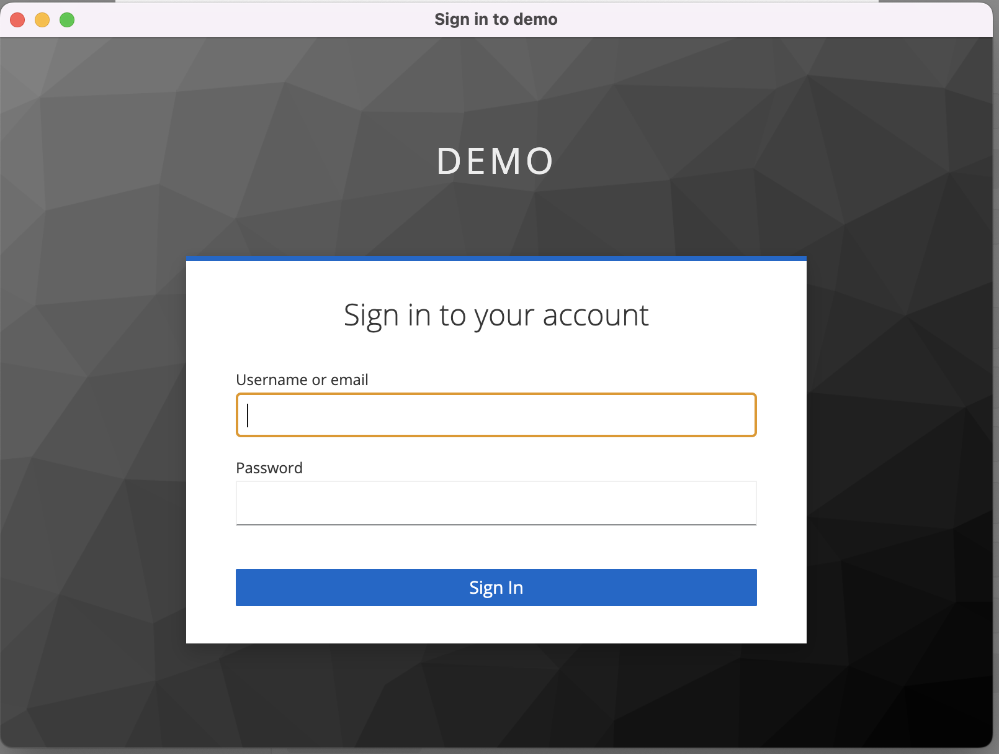

# **Securing Quarkus APIs with Keycloak**


## Objective

Example of backend/api application developed in quarkus protected and integrated with OIDC Keycloak authorization service.


In our example we will basically have 3 actors: the **authorization server**, responsible for issuing JWT tokens and represented by the keycloak, the postman that will be used to simulate a front-end application and our REST API developed in quarkus and protected by authorization server.


As an example are the following endpoints:

- **/hello** - unauthenticated public access service
- **/hello/default** - authorized service for standard user and administrator
- **/hello/admin** - authorized service only for admin user
- **/hello/profiles** - authorized service for any authenticated user


We will use a default configuration for users with access profiles based on *Roles*(RBAC - Role Based Access Control), to authorize users to consume the APIs. We will then have the following users with their respective profiles:

| USERNAME     | PASSWORD | CLIENT    | ROLES               |
| ------------ | -------- | --------- | ------------------- |
| demo         | 1234     | hello-app | NDA                 |
| demo-default | 1234     | hello-app | DEFAULT_USER        |
| demo-admin   | 1234     | hello-app | DEFAULT_USER, ADMIN |

## Keycloak Authorization Server

In an attempt to facilitate the execution and testing of the example, we are providing an export of the realm **demo-realm.json** to import the configured users, client and roles.

The keycloak can also be downloaded from the website: [https://www.keycloak.org/downloads](https://www.keycloak.org/downloads), with other execution options for development.

Users, clients and roles must be configured according to the users table presented in the previous section.

To run or start the local keycloak (legacy wildfly package):

```shell
cd $KEYCLOAK_HOME/bin
sh standalone.sh 
```

To run on different ports, in case of a ***wildfly*** package:

```shell
cd $KEYCLOAK_HOME/bin
sh standalone.sh -Djboss.socket.binding.port-offset=100
```

For other types of installation see the documentation: [https://www.keycloak.org/guides](https://www.keycloak.org/guides)

## API hello-app

### Application configuration

Quarkus extension used for OIDC:

```xml
<!-- OIDC extensions -->
<dependency>
  <groupId>io.quarkus</groupId>
  <artifactId>quarkus-oidc</artifactId>
</dependency>
```

Extension added after creating quarkus project with quarkus CLI:

```shell
quarkus create app com.redhat.demo:rest-api-keycloak:1.0
```

For more information on creating quarkus projects: [https://quarkus.io/guides/getting-started](https://www.keycloak.org/guides), for projects with community.

For those who have a Red Hat subscription which supports [Red Hat build of Quarkus](https://access.redhat.com/products/quarkus) it is recommended to use the supported  version by Red Hat. You can also create the project on usingthe page: [https://code.quarkus.redhat.com/](https://code.quarkus.redhat.com/) that already containing the supported version.

Then we set the properties version to a version ***supported by Red Hat***, as of this writing:

```xml
<properties>
  <!-- Omitted properties -->
	<quarkus.platform.group-id>com.redhat.quarkus.platform</quarkus.platform.group-id>
  <quarkus.platform.artifact-id>quarkus-bom</quarkus.platform.artifact-id>
  <quarkus.platform.version>2.13.7.Final-redhat-00003</quarkus.platform.version>
  <!-- <quarkus.platform.group-id>io.quarkus.platform</quarkus.platform.group-id> -->
  <!-- <quarkus.platform.version>2.10.1.Final</quarkus.platform.version> -->
</properties>
```

OIDC configuration in *src/main/resource/* ***application.properties***

```properties
# OIDC Configuration
quarkus.oidc.auth-server-url=http://localhost:8180/realms/demo
quarkus.oidc.client-id=hello-app
quarkus.oidc.credentials.secret=mQoWzSJNIFbpxrRhwaqDmouy0Z3pQOAE
quarkus.oidc.tls.verification=none
```

Configuration of the ***api resources***:

```java
@Path("/hello")
public class GreetingResource {

    @Inject
    SecurityIdentity securityIdentity;

    @Inject
    JsonWebToken jwt;

    @GET
    @PermitAll
    @Produces(MediaType.TEXT_PLAIN)
    public String hello() {
        return "Hello from RESTEasy Reactive";
    }

    @GET
    @Produces(MediaType.TEXT_PLAIN)
    @Path("/default")
    @RolesAllowed({"DEFAULT_USER","ADMIN"})
    public String helloDefaultUser() {
        OidcJwtCallerPrincipal oidcPrincipal = getOIDCPrincipal();
        String username = String.valueOf(oidcPrincipal.claim("preferred_username").orElseThrow());;
        return "Hello, Your user is the: " + username;
    }

    @GET
    @Produces(MediaType.TEXT_PLAIN)
    @Path("/admin")
    @RolesAllowed("ADMIN")
    public String helloAdminUser() {
        OidcJwtCallerPrincipal oidcPrincipal = getOIDCPrincipal();
        String username = String.valueOf(oidcPrincipal.claim("preferred_username").orElseThrow());
        return "Hello user: " + username + ", Only administrators can use that resource";
    }


    @GET
    @Produces(MediaType.TEXT_PLAIN)
    @Path("/perfis")
    @Authenticated
    public String helloPerfisString() {
        OidcJwtCallerPrincipal oidcPrincipal = getOIDCPrincipal();
        JsonObject resource_access = (JsonObject) oidcPrincipal.claim("resource_access").get();
        String username = String.valueOf(oidcPrincipal.claim("preferred_username").orElseThrow());
        return "Hello User : " + username + ", you have the following profiles: " +  resource_access.getJsonObject("hello-app").getJsonArray("roles");
    }

    private OidcJwtCallerPrincipal getOIDCPrincipal() {
        Principal principal = securityIdentity.getPrincipal();
        OidcJwtCallerPrincipal oidcPrincipal = null;
        if(principal instanceof OidcJwtCallerPrincipal) {
            oidcPrincipal = (OidcJwtCallerPrincipal) principal;
        }
        return oidcPrincipal;
    }
}
```

Regarding authentication and authorization settings:

- To allow any access to a *resource*, use the *annotation* **@PermitAll**
- To allow any explicitly authenticated access, use the *annotation* **@Authenticated**
- To make use of RBAC when accessing resources, use the *annotation* **@RolesAllowed({})**, with the list of profiles.

### Token Claims and SecurityIdentity Roles

SecurityIdentity roles can be mapped by checking the JWT access token as follows:

- If the `quarkus.oidc.roles.role-claim-path` property is set and matching array or string claims are found, then roles are extracted from those claims.
- If the `groups` claim is available then its value is used.
- If claim`realm_access/roles` or `resource_access/${client_id}/roles` (where `${client_id}` is the value of property `quarkus.oidc.client-id`) is available then its value is used . These claims are exactly what Keycloak emits in its tokens.

Additionally, a custom **SecurityIdentityAugmentor** can also be used to add the functions as documented [here](https://quarkus.io/version/2.7/guides/security#security-identity-customization).

### Running the application

To run with embedded maven:

```shell
./mvnw quarkus:dev
```

### Tests

To test the functioning of the APIs, we are making this Postman Collection available with calls to resources configured to run *localhost*.

 [Quarkus Demo.postman_collection.json](./Quarkus-Demo.postman_collection.json) 

#### Getting the token

After importing the collection to postman, just select the resource you want to test and select the ***authorization*** tab:


Select the type of authorization for ***OAuth 2.0***, and fill in the information if necessary:

**Grant Type**: Authorization Code

**Auth URL:** http://localhost:8180/auth/realms/demo/protocol/openid-connect/auth

**Access Token URL:** http://localhost:8180/realms/demo/protocol/openid-connect/token

**Client-id:** postman

**Secret:** 88tkIw8ceZ1pLbtoh4UU9SMmTuNeXUPw

**Scope:** openid

> Some of the data above may change depending on the Realm configuration you are using.


Select the `Get New Access Token` button and start the standard authentication flow.




Enter username and password:


Selecting the `Use Token` button after authentication:


Trigger a call to the desired resource on the `Send` button:


Observe the return of the service:


In our example, the user ***demo*** is not authorized to access resource ***/hello/default***.


#### Do it yourself

You can now continue with the tests on the other endpoints. =)